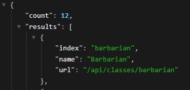

# D&D API Character Creator

The objective of this project was to create a website with HTML, CSS, and JavaScript using the React Library.

This website uses two D&D themed API's to fetch and display character data that the user can then select through to build a character for the game.
## Live Deployment
 [View Project Here](https://magnificent-zuccutto-9e11d8.netlify.app/)

## Motivation
This is the final project of the second module of my Software Engineering bootcamp. 

### The requirements for this project were:
The required features for this project were listed very minimally but we were encouraged to show what we've learned.

1. Built with HTML, CSS, JavaScript using the React Library
2. Hosted on CodeSandbox or Netlify
3. Frequent Commits to github
4. A README.mdfile with explanations of the technologies used, the approach taken, a link to your live site, installation instructions, unsolved problems, etc.
5. Use Fetch and UseEffect to make a request to an external data source like OMDBapi and insert some of the data retrieved into your State and display it on the screen
### Stretch Goals (Not Mandatory):
- Have one or more complex user interface modules such as a carousel, drag and drop, a sticky nav, tooltips, etc
- Look into localstorage so you can save data to the user's browser
- Utilize Redux or the Context API

## Screenshots
Using [Wireframe.cc](https://wireframe.cc/J1oUMu) created a mock up design

Here is a display of a user selected character on the completed page:


## Framework
Built in VS code
- React
- Vite: for generating a boiler plate react setup 
- React-router-dom: to replicate a multipage website in a single page system
- Redux: for global state in a store
- axios: for easy one line await-fetch
- tailwindCSS: for all styling

## API's
- [D&D 5e API](https://www.dnd5eapi.co/docs/#overview)
- [Open5e](https://open5e.com/)


## Features


The data from this API is fragmented across many pages 



- I used the```useLocation()``` hook to pass state through react-router-dom ```<Link />```'s so the subsequent data could be fetched on the next page.

- There is both a nav bar listing all the pages and a smart button that checks what steps the user has completed and directs them to the next logical step.
- I utilized Redux and the global store to save data from each step of the process to display on the main page. As well as local storage to save the data to the browser.
- The entire website was styled with the tailwind framework. This was my first time using it and while the installation was daunting, the speed at which I was able to style all the buttons and links with color changes on hover and transitions on activate was amazing. 
- A character sheet built with grid and functions to convert data from mutiple pages into an easy to read format.
### Not Yet Implemented: 
- Pictures: I would have liked to add a profile picture for each race and a class icon to display on the main page but I didnt have time to create them myself and couldn't find free resources online.
- Responsiveness: The scope of this project was very large for the time frame and I wasn't able to try and make things responsive. However, as I was learning tailwind I discovered lots of functionality for this that I am excited to try in my next project. 
- A "Create Random Character" button on the home screen using the data from the API downloaded and then sorted through due to the limitations of the data structure online.


## Credits
- [Noise Background Image Generator](https://php-noise.com/) i used this to create a background, it is an API but for this project I did not use that functionality.
- [Prebuilt Shading Examples](https://getcssscan.com/css-box-shadow-examples) list of css shadow boxes to use.
- [wireframe.cc](https://wireframe.cc/) for designing a mockup.
- [coolors.co](https://coolors.co/generate) and [encycolorpedia.com](https://encycolorpedia.com/) for picking colors for the theme.


